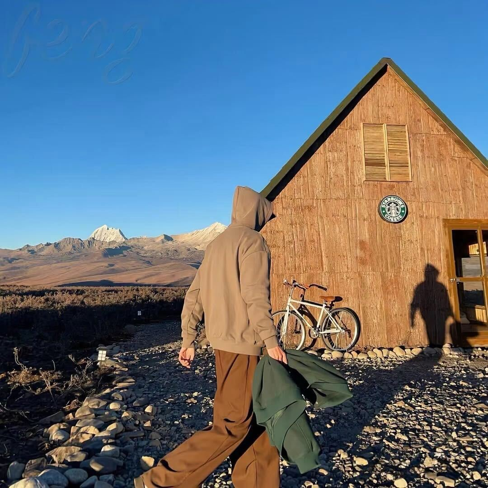

# 📝 版本更新日志

> 作者： @Forrest-吉庆喆
>## 不会及时去更新，可能会忘

---

## 🏎️ V 4.0.1

**主要更新**

- 🎇 查看界面的音乐播放，允许拖动波形图以调整播放进度（之前的拖动并不跟手）
- 🪃 增加版本更新引导页面按钮（默认是用户第一次打开和版本号更新时才弹出，弹出后会记录弹出记录，下次不再弹出，当然，内容也可以自定义）

## 🪫 V 4.0.0

**主要更新**

- ✡️ 修改URL展示方式，去除.php后缀的显示
- 🎧 主页支持多种音频文件的播放
- 🎵 当搜索时，文件是音频文件的话，会有查看按钮，点击后将会跳转至查看页面，页面内新增了播放器的支持
- 😅 还有啥记不清了，因为提交的有点乱，项目管理的不是很好，自行看代码吧

>版本号直接升到4.0.0，是因为中间提交的太多，我感觉现在已经可以正常的使用了，直接一个大版本号吧！🐽🐽🐽

## 🚀 V 3.5.8

**主要更新：**

- ✨ 优化登录和自动登录逻辑，提升安全性和体验
- 🛠️ 统一版本号管理，支持点击查看更新说明
- 🎨 美化版权信息和时间显示
- 📢 加入版本更新说明页

> **提示：**  
> 本次更新重点提升了用户体验和安全性。

对于免登录期限的控制，在`login.php`中修改代码即可

**代码示例：**

```php
// 统一设置“记住我”天数
$remember_days = 30;  //天数
$remember_seconds = $remember_days * 24 * 60 * 60;  //时分秒的设置
```

**更新内容表格：**

| 功能模块 | 说明         | 状态 |
| -------- | ------------ | ---- |
| 登录     | 优化自动登录 | ✅   |
| 版本号   | 统一管理     | ✅   |
| 界面     | 美化版权信息 | ✅   |
| 更新说明 | 更新说明的页面 | ✅ |

---

## 🌟 V 3.5.7

- ➕ 新增“记住我”免登录功能
- 🐞 修复部分已知问题

**说明：**
> 记住我功能支持 30 天免登录，安全性已加强。


**新增和优化详情：**
- 支持功能
    - 自动登录
    - 勾选“记住我”
    - 登录后 30 天内免登录
- 安全性
    - Token 机制
    - Cookie 安全


---

> 之前历史版本并没有记录更新内容，所以说从上面的V 3.5.7版本开始

